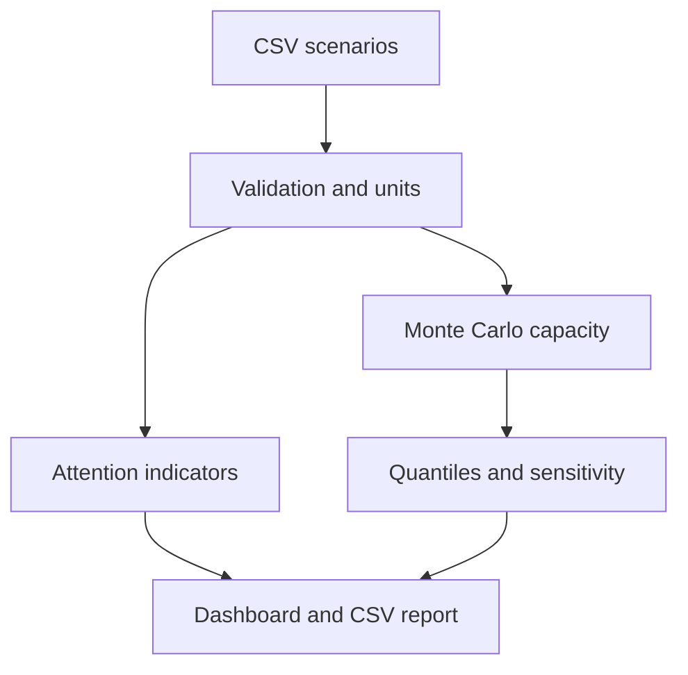

# BasinLens CCS

[](https://github.com/delimune04/basinlens-ccs/actions/workflows/ci.yml)

**Transparent, uncertainty-aware screening for geologic CO2 storage concepts.**

BasinLens CCS is an early Python prototype that turns uncertain storage-area,
thickness, porosity, CO2-density, and efficiency assumptions into a
reproducible volumetric capacity distribution. It also displays simple,
fully documented **attention indicators** for caprock thickness, mapped-fault
proximity, and legacy-well density.

> [!WARNING]
> Research and educational prototype only. Results are not a site-suitability,
> containment-safety, regulatory, engineering, or investment determination.

## Why this project exists

Early screening tools often hide assumptions inside spreadsheets or present a
single deterministic capacity number. This prototype explores a different
workflow:

1. make each uncertain input explicit;
2. propagate uncertainty rather than hide it;
3. separate capacity from containment questions;
4. keep heuristic thresholds visible and replaceable; and
5. produce a workflow that another researcher can reproduce.

## Current features

- validated low / most-likely / high inputs;
- Monte Carlo volumetric capacity simulation;
- Q10, Q50, and Q90 statistical quantiles;
- rank-correlation sensitivity analysis;
- transparent, demonstration-only containment-attention indicators;
- CSV batch analysis and reproducible run metadata;
- interactive Streamlit dashboard;
- synthetic example sites and unit tests; and
- automated GitHub Actions checks on Python 3.10 and 3.12.

## Quick start

```bash
git clone https://github.com/delimune04/basinlens-ccs.git
cd basinlens-ccs
python -m venv .venv
source .venv/bin/activate  # Windows: .venv\Scripts\activate
python -m pip install -e ".[app]"
```

Run the batch example:

```bash
basinlens examples/synthetic_sites.csv --output outputs --samples 20000 --seed 42
```

Launch the dashboard:

```bash
streamlit run app.py
```

Run the tests without additional test dependencies:

```bash
python -m unittest discover -s tests -v
```

With the bundled synthetic inputs, 20,000 samples per site, and random seed 42,
the current prototype produces:

| Synthetic concept | Q10 (Mt) | Q50 (Mt) | Q90 (Mt) | Attention |
|---|---:|---:|---:|---|
| Aurora | 4.95 | 7.56 | 11.20 | Lower (9.78/100) |
| Borealis | 3.67 | 5.92 | 8.93 | Moderate (48.15/100) |
| Caldera | 7.44 | 11.11 | 16.03 | Very high (82.78/100) |

The examples are invented to test the workflow and must not be interpreted as
real formations or storage prospects.

## Capacity model

The v0.1 screening equation is:

\[
M_{CO_2} = A h \phi \rho_{CO_2} E
\]

The five inputs are sampled independently from triangular distributions. The
reported Q10/Q50/Q90 values are statistical quantiles, not petroleum-reserve
exceedance labels. See [the methodology](docs/METHODOLOGY.md) for units,
thresholds, important omissions, and starting scientific references. The model
is directionally aligned with public USGS and U.S. DOE/NETL resource-estimation
methods, but v0.1 has not yet been validated against either implementation.

## Workflow



## Repository layout

```text
src/basinlens_ccs/    calculation and validation package
tests/                unit and reproducibility tests
examples/             synthetic demonstration inputs
docs/                 methodology and learning roadmap
app.py                Streamlit demonstration interface
```

## Development direction

The next meaningful step is not a more complicated score. It is replacing a
synthetic scenario with a well-documented public dataset and validating one
part of the workflow against a published method. The longer-term milestones
are listed in [the learning roadmap](docs/LEARNING_ROADMAP.md).

## 한국어 프로젝트 방향

이 저장소는 지질학적 CO2 저장 후보지를 실제로 승인하거나 안전성을
판정하는 프로그램이 아닙니다. 현재 버전은 입력 불확실성을 저장 용량
분포로 전파하고, 추가 조사가 필요한 항목을 투명한 규칙으로 표시하는
교육·연구용 프로토타입입니다. 수능 전에는 설계와 가정을 함께 검토하고,
수능 이후에는 핵심 코드를 직접 다시 구현하는 학습 계획을 따릅니다.

## License

Apache License 2.0. See [LICENSE](LICENSE).
