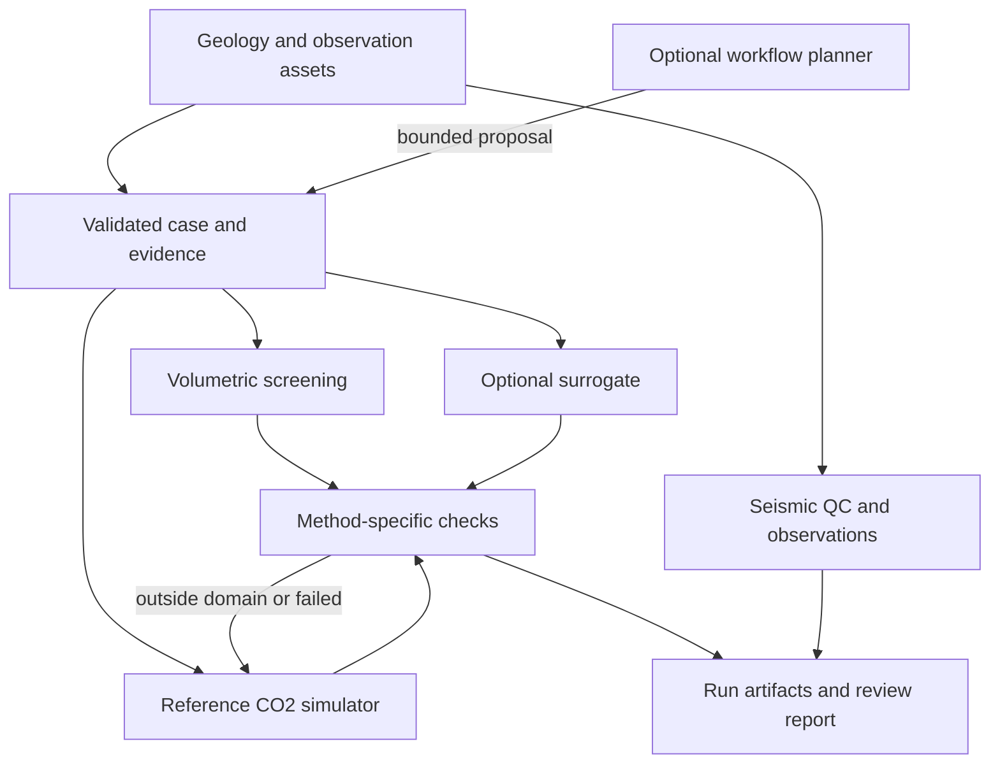

# Architecture and data contracts

Draft · 2026-10-03. Only the volumetric engine and CLI run bundle are implemented.
The following adapter, seismic, GPU, and agent interfaces are design targets.

## Scientific core and optional execution layers

The volumetric path estimates a conceptual resource; it does not generate a pressure
or plume field. A reference solver produces physics outputs. A trained surrogate
may approximate those outputs only within its tested domain. A failed reference
simulation remains a failure; it cannot be relabeled successful by an AI summary.

## Proposed modules

| Layer | Responsibility | Implementation sequence |
|---|---|---|
| `models`, `io` | quantities, missingness, case/evidence validation | strengthen existing code |
| `capacity`, `screening` | conceptual resource and investigation indicators | existing; audit assumptions |
| `artifacts` | reproducible output bundle and integrity check | implemented in v0.2.0 |
| `adapters/opm` | validate/render a deck, execute, parse physical outputs | first optional engine |
| `seismic` | SEG-Y metadata, coordinate/vintage QC, comparisons | after small dataset registration |
| `surrogates` | training, normalization, inference, domain checks | after reference dataset |
| `workflow` | bounded sweeps, status, recovery, proposal review | deterministic runner before LLM |
| CLI / Streamlit | invoke core and display measured results | existing demonstration interfaces |

Keep CPU screening installable without CUDA, PyTorch, LLM keys, database services,
or a reservoir simulator. Optional dependencies get separate extras/environments
only when an adapter has a runnable test. Initially use files and SQLite for job
records; a multi-user API and enterprise identity integration require a real pilot
need before adding a service stack.

## Case contract: next implementation target

Fields below are proposed, not silently accepted by the legacy CSV reader.

| Entity | Required content |
|---|---|
| Project | schema version, project/case ID, owner, purpose, assessment level |
| Quantity | value or distribution, physical unit, source ID, observation/assumption flag |
| Asset | URI/local identifier, SHA-256, licence reference, attribution, date/version |
| Geometry | CRS, depth datum, coordinate axis convention, grid and active-cell mapping |
| Static model | porosity, permeability tensor, layering, seal/fault evidence, uncertainties |
| Fluid and controls | CO₂–brine formulation, PVT, salinity, temperature, relperm, pressure datum, well schedule |
| Observation | vintage, processing history, measurement support and uncertainty |
| Execution plan | engine/version, seed, case hash, permitted parameter bounds, job/compute budget |
| Result | actual engine, quantity/unit, time/grid, diagnostics, validation and review status |

Missing evidence is explicit. Do not convert absent fault maps to “no faults,” absent
well records to zero well density, or unspecified efficiency to a measured value.
Pressure is absolute or differential with a documented datum; injection rates must
specify mass versus volume and surface versus reservoir conditions.

## Run bundle: implemented contract

`manifest_schema_version = 1` describes these files:

| File | Content |
|---|---|
| `input.csv` | exact bytes read by the CLI |
| `summary.csv` | capacity quantiles and illustrative attention components |
| `sensitivity.csv` | per-site parameter rank correlations |
| `report.md` | deterministic numerical summary and interpretation limits |
| `run_metadata.json` | completion status, run ID/time, per-site seeds, versions, source fingerprint, file sizes/hashes |

The source fingerprint covers the package's Python files, not data provenance, a
Git commit, a dependency lock, or scientific validation. A checksum proves agreement
with this manifest; it does not authenticate an edited manifest. Byte-identical
outputs are expected only for the same inputs, input order, source, and compatible
runtime. Run timestamps and UUIDs intentionally differ.

CLI output paths must be new. The manifest is written last. An interrupted write can
leave a partial directory without a completed manifest. Use `basinlens-verify` before
consuming a bundle; a missing or changed artifact fails verification. Streamlit
currently uses its existing display workflow and does not yet export this bundle.

## Adapter and job design

Each physical engine implements a versioned `validate_case → prepare → run → collect`
contract. `collect` returns only parsed, finite, unit-labelled fields plus convergence
and conservation diagnostics. Simulator exit code zero alone is insufficient.

Jobs move through `planned → running → completed → validated` or `failed/cancelled`.
Store the original case, actual parameter change, logs, engine version, and result
hash. Retries are bounded and recorded; altered convergence settings become a new
case. Neither a planner nor a retry may silently alter geological interpretation,
pressure limits, relative permeability, or experimental evidence.

The planner emits a typed proposal. A deterministic validator handles parameter
bounds, allowed tool actions and budgets. Small pre-authorized sweeps may execute
automatically; scientific scope changes and spending beyond the configured budget
require explicit review. No paid model endpoint or external data transfer is enabled
in v0.2.0.

## Deployment progression

Single-user local research → reproducible container/engine environment → limited
team pilot with access control, backups, audit and support procedures → evaluated
production use within an agreed scope. All stages keep numerical kernels usable
without an LLM. Confidential field data stays in the selected project storage;
external inference is an explicit deployment decision.
